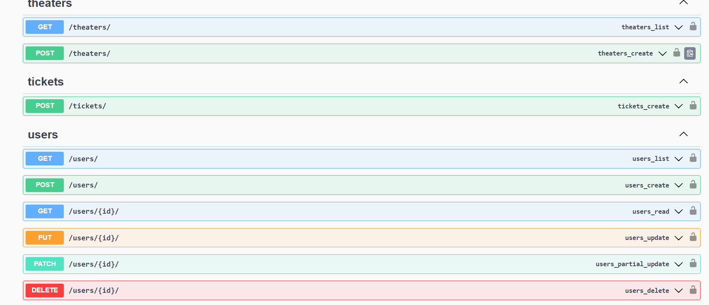
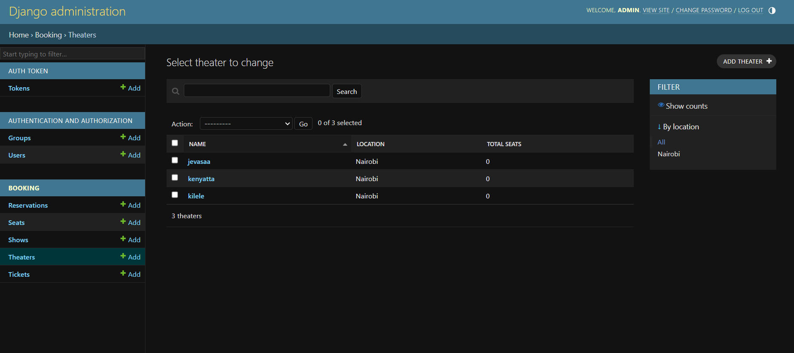
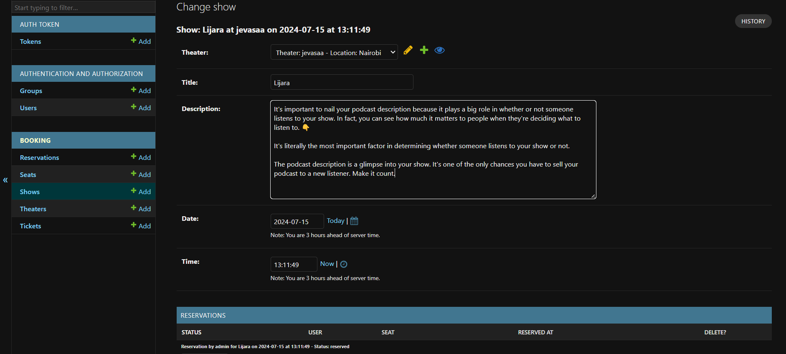

# Theater Ticketing System

## Overview
This project is a theater ticketing system built using Django, PostgreSQL, Redis, and Celery. It provides APIs for user authentication, theater management, seat reservation, and show scheduling.

## Features
-Authentication
JWT Authentication: Secure user authentication using JSON Web Tokens.
-User Interaction
    -List All Theaters for Specific Dates
Endpoint: /api/theaters/
Method: GET
Parameters:
date: Date in YYYY-MM-DD format (optional, defaults to current date)

- List Available Seats for a Selected Theater
- Endpoint: /api/theaters/<theater_id>/seats/
Method: GET
Parameters:
show_id: ID of the show (optional, defaults to next available show)

- Reserve a Preferred Seat for a Specific Show
Endpoint: /api/seats/<seat_id>/reserve/

Method: POST
Request Body:
json
'''
{
  "show_id": "show_id",
  "user_id": "user_id"
}
'''

seat_id: ID of the seat to reserve
show_id: ID of the show for which the seat is being reserved
user_id: ID of the user reserving the seat
## Administration
- Admin Management
Endpoint: /admin/
Functionality: Manage theaters, shows, seats, users, and reservations through the Django admin panel.

Task Queue and Scheduling
Celery with Redis
- Functionality: Asynchronous task execution for background tasks such as email notifications, reservation updates, and show scheduling.

## Database
PostgreSQL
- Database: Stores information about theaters, shows, seats, users, and reservations.

Caching
Redis

Caching: Speeds up seat availability queries and other read-heavy operations.

## Setup Instructions
Prerequisites
- Python 3.x
- Django
- PostgreSQL
- Redis

## Installation
- Clone the repository:

git clone https://github.com/kemoeverlyne/theatre-booking-system

cd repository
Install dependencies:

pip install -r requirements.txt
Set up PostgreSQL and Redis according to your environment.

Apply database migrations:

python manage.py migrate

- Start Celery worker:

 celery -A myproject worker -l info

- Run Django development server:

python manage.py runserver

Access the API at http://localhost:8000/api/