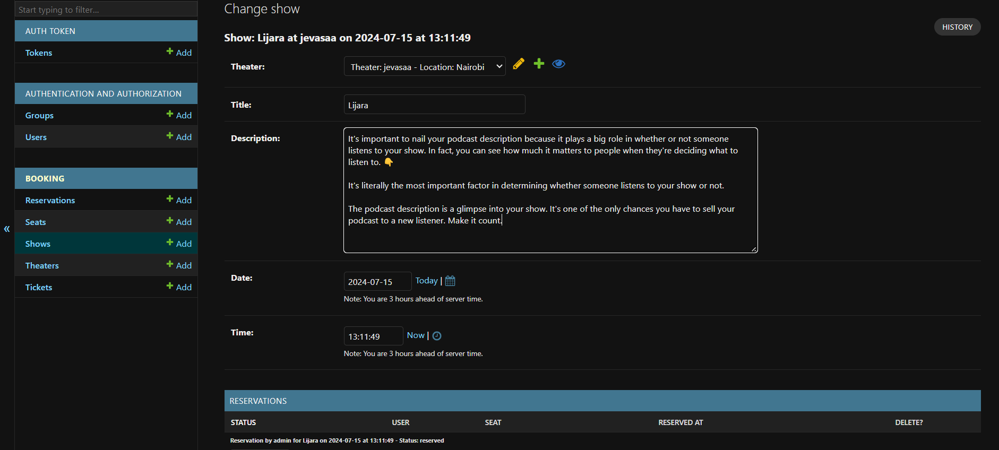

# theatre Booking System

This is an online theatre ticket booking system built with Django and Django REST framework.

## Features

- User registration and login

- Search for theatres
- Block seats
- Book tickets
- View bookings

## Requirements

- Python 3.x
- Django
- Django REST framework
- Django Simple JWT
- drf-yasg (Swagger for API documentation)

## Installation

1. Clone the repository:

    ```bash
    git clone https://github.com/abhi250520/theatre-booking-system.git
    cd theatre-booking-system
    ```

2. Create a virtual environment and activate it:

    ```bash
    python -m venv venv
    source venv/bin/activate  # On Windows use `venv\Scripts\activate`
    ```

3. Install the dependencies:

    ```bash
    pip install -r requirements.txt
    ```

4. Apply the migrations:

    ```bash
    python manage.py migrate
    ```

5. Create a superuser:

    ```bash
    python manage.py createsuperuser
    ```

6. Run the development server:

    ```bash
    python manage.py runserver
    ```

7. Open your browser and go to `http://127.0.0.1:8000/` to see the application.

## API Documentation

The API documentation is available at `http://127.0.0.1:8000/swagger/` (Swagger UI) and `http://127.0.0.1:8000/redoc/` (ReDoc).



